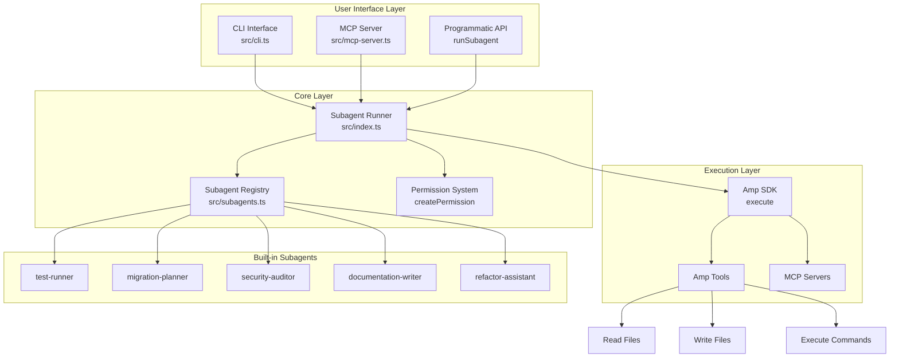

# Architecture & Design Decisions

This document explains the technical architecture, design patterns, and implementation decisions for the custom subagent system.

## System Architecture



The system is organized in four layers:

1. **User Interface Layer** - Multiple entry points (CLI, MCP, API)
2. **Core Layer** - Subagent execution logic and registry
3. **Execution Layer** - Amp SDK integration and tool access
4. **Subagent Layer** - Pre-built specialized agents

## Project Structure

```
custom-subagent/
├── src/
│   ├── index.ts              # Core subagent runner and types
│   ├── subagents.ts          # Subagent registry definitions
│   ├── cli.ts                # Command-line interface
│   ├── mcp-server.ts         # MCP protocol server
│   └── examples/             # Usage examples
│       ├── test-runner-example.ts
│       ├── migration-example.ts
│       └── security-example.ts
├── package.json              # Dependencies and scripts
├── tsconfig.json             # TypeScript configuration
├── amp-config.json           # Amp MCP server config
├── README.md                 # User documentation
├── SETUP.md                  # Installation guide
└── ARCHITECTURE.md           # This file
```

## Alignment with Amp SDK

This implementation aligns with Amp's documented features:

### Subagent Execution Model
- **Context Passing**: Each subagent receives focused conversation context relevant to its task
- **Isolated Execution**: Each subagent runs with isolated context via `execute()` (stateless between invocations)
- **Tool Access**: Subagents have scoped access to Amp tools (Read, Write, Bash, MCP)
- **Structured Output**: Subagents return summary, transcript, file changes, and metadata to the main thread

### Permission System
Mirrors Amp's permission rules:
- `createPermission(tool, action, matches)` matches Amp's documented API
- Actions: `allow`, `deny`, `ask` (we omit `delegate` for simplicity)
- Pattern matching on `cmd` for Bash, `path` for Read/Write
- Follows precedence: more specific rules override general ones

### MCP Integration
- Optional `mcp` field in subagent definition
- Supports both local (`command`, `args`, `env`) and remote (`url`, `headers`) servers
- Passed through to `execute()` options

## Key Design Patterns

### 1. Registry Pattern
```typescript
type SubagentRegistry = Record<string, NamedSubagent>
```
- Centralized subagent definitions
- Easy to extend and maintain
- Type-safe lookups

### 2. Declarative Configuration
```typescript
{
  system: string,           // Role and behavioral rules
  permissions: Permission[], // Tool access control
  mcp?: MCPConfig           // Optional MCP servers
}
```
- Separation of concerns: identity, permissions, tools
- Composable and reusable
- Clear security boundaries

### 3. Execution Abstraction
```typescript
runSubagent(name, goal, registry, options): Promise<SubagentResult>
```
- Hides Amp SDK complexity
- Consistent interface across all subagents
- Optional callbacks for streaming
- Returns structured result with summary, transcript, and file changes

## Permission Philosophy

### Read-Only Agents (Analysts)
```typescript
createPermission('Read', 'allow'),
createPermission('Write', 'deny'),
```
For: migration-planner, security-auditor

### Cautious Writers
```typescript
createPermission('Write', 'ask'),
```
For: test-runner, documentation-writer

### Focused Execution
```typescript
createPermission('Bash', 'allow', { matches: { cmd: 'npm test*' } }),
```
For: test-runner (only test commands)

## Differences from Claude's Subagents

| Aspect | Claude | This Implementation |
|--------|--------|---------------------|
| Registration | Pre-configured in platform | Dynamic, code-based registry |
| Invocation | Natural language (@subagent) | Programmatic API |
| Scope | Platform-wide | Per-project customizable |
| Permissions | Implicit | Explicit, declarative |
| MCP | Separate configuration | Inline with subagent definition |

## Future Enhancements

### 1. Subagent Composition
Allow subagents to coordinate other subagents for complex workflows:
```typescript
const compositeAgent = {
  system: 'You coordinate multiple subagents',
  subagents: ['test-runner', 'migration-planner'],
  permissions: [
    createPermission('Task', 'allow'), // Allow spawning subagents
  ]
}
```

### 2. Stateful Subagents
Enable subagents to maintain state across invocations:
```typescript
const statefulAgent = {
  state: new Map(),
  onResult: (result) => state.set('lastRun', result),
  onStart: () => state.get('lastRun'), // Resume from previous state
}
```

### 3. Parallel Execution
Run multiple subagents concurrently for improved performance:
```typescript
const results = await Promise.all([
  runSubagent('test-runner', goal1, registry),
  runSubagent('migration-planner', goal2, registry),
])
```

### 4. Custom Approval Workflows
Implement advanced permission handling with custom approval logic:
```typescript
permissions: [
  createPermission('Write', 'ask', { 
    validator: async (tool) => await approvalService.check(tool) 
  }),
]
```

### 5. Result Streaming
Stream partial results back to the caller for long-running tasks:
```typescript
for await (const update of runSubagentStreaming('migration-planner', goal)) {
  console.log('Progress:', update)
}
```

## Security Considerations

1. **Least Privilege**: Default to `ask` or `deny`, only `allow` when necessary
2. **Path Restrictions**: Use glob patterns to limit file access
3. **Command Filtering**: Restrict Bash commands to known-safe patterns
4. **No `dangerouslyAllowAll`**: Always set to `false`
5. **MCP Validation**: Verify MCP server sources before registration

## Testing Strategy

1. **Unit Tests**: Test `runSubagent` with mocked `execute()`
2. **Integration Tests**: Run real subagents against fixture projects
3. **Permission Tests**: Verify permissions block/allow expected tools
4. **Timeout Tests**: Ensure subagents abort after timeout
5. **Error Tests**: Validate error handling for missing subagents

## Performance Notes

- Each subagent call creates a new Amp execution context (overhead ~100-500ms)
- For tight loops, consider batching or using a single subagent
- MCP servers add latency; prefer built-in tools when possible
- Streaming via `onMessage` reduces perceived latency

## Implementation Details

### Core Components

#### 1. `runSubagent()` Function
Located in `src/index.ts`, this is the main entry point for executing subagents.

**Flow:**
1. Validates subagent exists in registry
2. Constructs prompt combining system role + user goal
3. Executes via Amp SDK's `execute()` with scoped permissions
4. Handles message streaming and timeout
5. Returns final result to caller

**Key Features:**
- Abort controller for timeout handling
- Message streaming via callback
- Error handling and validation
- Working directory support

#### 2. Subagent Registry
Located in `src/subagents.ts`, defines all available subagents.

**Structure:**
```typescript
{
  'subagent-name': {
    system: string,           // Role and rules
    permissions: Permission[], // Tool access control
    mcp?: MCPConfig           // Optional MCP servers
  }
}
```

#### 3. MCP Server
Located in `src/mcp-server.ts`, exposes subagents as MCP tools.

**Responsibilities:**
- Implements MCP protocol (tools/list, tools/call)
- Converts subagents to MCP tool definitions
- Handles tool invocation and error responses
- Runs on stdio transport for Amp integration

#### 4. CLI Interface
Located in `src/cli.ts`, provides command-line access.

**Features:**
- Interactive subagent execution
- Real-time message streaming
- Error handling and user feedback
- Working directory customization

### Type System

```typescript
// Core types defined in src/index.ts
type NamedSubagent = {
  system: string
  mcp?: MCPConfig
  permissions?: ReturnType<typeof createPermission>[]
}

type SubagentRegistry = Record<string, NamedSubagent>

interface RunSubagentOptions {
  cwd?: string
  onMessage?: (msg: any) => void
  timeout?: number
}
```

### Permission Matching

Permissions are evaluated in order:
1. **Exact matches** are checked first (e.g., specific file paths)
2. **Pattern matches** using glob patterns (e.g., `**/*.test.*`)
3. **General rules** as fallback

Example permission resolution:
```typescript
// Most specific to least specific
createPermission('Write', 'deny', { matches: { path: 'src/critical.ts' } })
createPermission('Write', 'ask', { matches: { path: 'src/**' } })
createPermission('Write', 'allow')
```

## Extension Points

### Adding New Subagents

1. **Define in registry** (`src/subagents.ts`):
```typescript
export const subagents: SubagentRegistry = {
  'new-agent': {
    system: 'Your role definition...',
    permissions: [...],
  }
}
```

2. **Create example** (`src/examples/new-agent-example.ts`):
```typescript
import { runSubagent } from '../index.js'
import { subagents } from '../subagents.js'

const result = await runSubagent('new-agent', 'task', subagents)
```

3. **Add script** (`package.json`):
```json
{
  "scripts": {
    "example:new-agent": "tsx src/examples/new-agent-example.ts"
  }
}
```

### Custom Permission Patterns

```typescript
// File type restrictions
createPermission('Write', 'allow', { matches: { path: '**/*.{test,spec}.*' } })

// Command prefix matching
createPermission('Bash', 'allow', { matches: { cmd: 'git status*' } })

// Multiple patterns
createPermission('Read', 'deny', { matches: { path: '{**/secrets/**,**/.env*}' } })
```

### MCP Integration

Connect external MCP servers to subagents:

```typescript
'database-agent': {
  system: 'You query and analyze databases.',
  mcp: {
    servers: {
      'postgres': {
        command: 'npx',
        args: ['-y', '@modelcontextprotocol/server-postgres'],
        env: { DATABASE_URL: process.env.DATABASE_URL },
      }
    }
  }
}
```

## Real-World Examples

### Example 1: CI/CD Integration

```typescript
// ci-validation subagent for pre-merge checks
'ci-validator': {
  system: `You validate code before CI/CD pipeline execution.
Rules:
- Run linting and type checks
- Execute all tests
- Verify build succeeds
- Check for security vulnerabilities
- Report pass/fail status`,
  permissions: [
    createPermission('Read', 'allow'),
    createPermission('Bash', 'allow', { matches: { cmd: 'npm run*' } }),
    createPermission('Bash', 'allow', { matches: { cmd: 'pnpm*' } }),
    createPermission('Write', 'deny'),
  ],
}
```

### Example 2: Code Review Assistant

```typescript
// code-reviewer subagent for automated reviews
'code-reviewer': {
  system: `You perform automated code reviews.
Rules:
- Check code quality and best practices
- Identify potential bugs and edge cases
- Verify test coverage
- Suggest improvements
- Never modify code, only provide feedback`,
  permissions: [
    createPermission('Read', 'allow'),
    createPermission('Bash', 'allow', { matches: { cmd: 'git diff*' } }),
    createPermission('Bash', 'allow', { matches: { cmd: 'npm run coverage*' } }),
    createPermission('Write', 'deny'),
  ],
}
```

### Example 3: Database Migration Helper

```typescript
// db-migrator subagent with database MCP server
'db-migrator': {
  system: `You help with database migrations.
Rules:
- Generate migration scripts
- Validate schema changes
- Check for breaking changes
- Create rollback scripts
- Test migrations in dry-run mode`,
  permissions: [
    createPermission('Read', 'allow'),
    createPermission('Write', 'ask', { matches: { path: '**/migrations/**' } }),
    createPermission('Bash', 'ask', { matches: { cmd: '*migrate*' } }),
  ],
  mcp: {
    servers: {
      'database': {
        command: 'npx',
        args: ['-y', '@modelcontextprotocol/server-postgres'],
        env: { DATABASE_URL: process.env.DATABASE_URL },
      }
    }
  }
}
```
