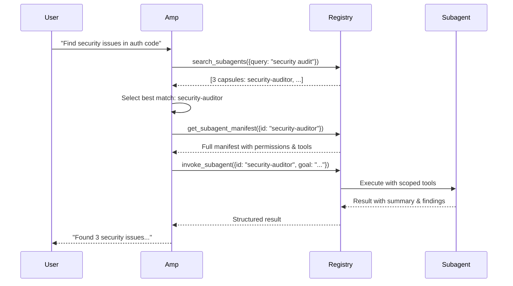

# Architecture V2: Registry with Lazy Discovery

This document describes the redesigned architecture using a hybrid registry approach with capsule-based lazy discovery.

## Design Goals

1. **Avoid context pollution** - Don't load all subagent descriptions upfront
2. **Support dozens of subagents** - Scale to 50-100+ specialized agents
3. **Natural language invocation** - Users can request subagents via NL or explicit `@alias`
4. **Latency tiers** - Fast inner loop (<5s) vs thorough outer loop (>5s)
5. **General-purpose framework** - Shareable across teams and organizations

## Core Components

### 1. Subagent Registry (`src/registry.ts`)

In-memory registry with semantic search capabilities:

```typescript
class SubagentRegistry {
  // Stores full manifests
  private manifests: Map<string, SubagentManifest>
  
  // Stores tiny capsules for discovery
  private capsules: Map<string, SubagentCapsule>
  
  // Search methods
  search(query): SubagentCapsule[]      // Returns small summaries
  getManifest(id): SubagentManifest     // Loads full manifest on demand
  list(): SubagentCapsule[]             // Browse all
}
```

**Key innovation**: Capsules are kept minimal (≤200 tokens) to avoid context pollution during discovery.

### 2. Capsule Model

Small discovery metadata returned during search:

```typescript
interface SubagentCapsule {
  id: string
  aliases?: string[]
  summary: string              // 1-2 lines, ≤200 tokens
  tags: string[]
  latencyClass: 'inner' | 'outer' | 'both'
  capabilities?: string[]
}
```

### 3. Manifest Model

Full subagent specification (loaded only when selected):

```typescript
interface SubagentManifest {
  // Identity
  id: string
  aliases?: string[]
  owner?: string
  version?: string
  
  // Discovery metadata
  summary: string              // Same as capsule
  description: string          // Detailed (≤800 tokens)
  tags: string[]
  latencyClass: LatencyClass
  capabilities?: string[]
  
  // Execution config
  systemPrompt: string
  toolRequirements?: {
    cliAllowlist?: CLIToolSpec[]
    mcpServers?: MCPServerRequirement[]
  }
  mcpConfig?: MCPConfig
  permissions?: Permission[]
  
  // Constraints
  contextBudget?: ContextBudget
  safety?: SafetyPolicy
  hostCompatibility?: HostCompatibility
  telemetry?: TelemetryData
}
```

### 4. Registry MCP Server (`src/registry-mcp-server.ts`)

Exposes 4 tools to Amp:

#### `search_subagents`
```typescript
{
  query: string               // "find security vulnerabilities"
  k?: number                  // Max results (default: 5)
  tags?: string[]             // Filter by tags
  latencyClass?: string       // 'inner' | 'outer' | 'both'
}
```

Returns capsules only - no full manifests to keep context small.

#### `get_subagent_manifest`
```typescript
{
  id: string                  // Subagent ID or alias
}
```

Returns full manifest for a single selected subagent.

#### `list_subagents`
```typescript
{
  tags?: string[]
  pageSize?: number
  offset?: number
}
```

Browse all subagents with pagination.

#### `invoke_subagent`
```typescript
{
  id: string
  goal: string
  context?: string
  cwd?: string
  timeoutMs?: number
}
```

Execute a subagent and return structured result.

## Invocation Flow

### Typical Workflow



### Explicit Invocation

```
User: "@security-auditor scan the authentication module"
Amp: (skip search, resolve alias directly)
Amp → get_subagent_manifest("security-auditor")
Amp → invoke_subagent(...)
```

## Latency Tiers

### Inner Loop (Fast, Focused)
- **Target**: <5 seconds
- **Use cases**: Code search, quick fixes, test runs, file operations
- **Routing**: K=3 capsules, single selection, strict timeout
- **Examples**: `code-search-agent`, `test-runner`

### Outer Loop (Thorough, Analytical)
- **Target**: 5-60+ seconds
- **Use cases**: Architecture planning, security audits, migration planning, reviews
- **Routing**: K=5-8 capsules, select 2-4 subagents, parallel execution
- **Examples**: `migration-planner`, `security-auditor`, `ace-reflector`

### Classification

Manifests specify `latencyClass`:
```typescript
{
  id: "code-search-agent",
  latencyClass: "inner",  // Fast search operations
  ...
}

{
  id: "migration-planner",
  latencyClass: "outer",  // Thorough analysis
  ...
}
```

## Tool Composition

Each manifest declares required tools:

```typescript
{
  id: "ado-librarian",
  toolRequirements: {
    cliAllowlist: [
      { name: "az", installHint: "brew install azure-cli" },
      { name: "jq", installHint: "brew install jq" }
    ],
    mcpServers: [
      { id: "codebase", capabilities: ["read", "search"] }
    ]
  },
  permissions: [
    createPermission('Bash', 'allow', { matches: { cmd: 'az devops*' } }),
    createPermission('Bash', 'allow', { matches: { cmd: 'jq*' } }),
    // ...
  ]
}
```

## Multi-Host Awareness

Registry filters by available capabilities:

```typescript
registry.search({
  query: "search code",
  hostCaps: {
    scm: ['github', 'azure'],  // Available SCM systems
    availableTokens: {
      gh: true,
      glab: false,
      az: true
    },
    os: 'darwin',
    hasGui: true
  }
})
```

Only returns subagents compatible with current environment.

## Search Algorithm

Keyword-based scoring with tag matching:

```typescript
function scoreRelevance(capsule, query):
  score = 0
  
  // Exact match (highest)
  if capsule.id == query or query in capsule.aliases:
    score += 100
  
  // Tag matching
  for tag in capsule.tags:
    if tag in query: score += 20
    for word in query.split():
      if word in tag: score += 5
  
  // Summary keywords
  for word in query.split():
    if word in capsule.summary: score += 10
  
  // Capability matching
  for cap in capsule.capabilities:
    if cap in query: score += 15
  
  // Boost by telemetry
  if capsule.telemetry?.successScore:
    score *= (0.8 + 0.2 * successScore)
  
  return score
```

Results sorted by score descending, top K returned.

## Caching Strategy

### Session Cache
- Stores last 20 search results
- TTL: 5 minutes
- Key: `{query, k, tags, latencyClass}`

### Manifest Cache
- Stores last 5 loaded manifests
- TTL: 5 minutes
- LRU eviction when full

### Warm Set
Pre-load frequently used subagents per workspace (future enhancement).

## Migration from Legacy

The system maintains backward compatibility:

1. **Legacy registry** (`src/subagents.ts`) still exists
2. **Manifest loader** (`src/manifest-loader.ts`) converts legacy format on-the-fly
3. **Automatic inference** of tags, latency class, capabilities
4. **CLI allowlist extraction** from permissions

No manual migration required - existing subagents work immediately.

## Future Enhancements

### 1. Embedding-Based Search
Replace keyword matching with semantic embeddings:
- Use `text-embedding-3-small` or similar
- Store vectors in SQLite with vector extension
- Hybrid: keyword + embedding

### 2. Multi-Registry Topology
- Local project registry (high priority)
- Team/org registry (medium priority)
- Global public registry (low priority)
- Federated search with result merging

### 3. Learned Router
Train classifier on `(query, selected_subagent)` pairs:
- Improves selection quality over time
- Reduces user intervention
- Personalizes per user/team

### 4. Sandboxed Execution
Run each subagent in isolated container:
- Declared toolchain pre-installed
- Scoped credentials
- Resource limits
- Network policies

### 5. Telemetry & Feedback Loop
Track outcomes and update rankings:
- Success/failure rates
- Typical latency
- User satisfaction scores
- Auto-adjust search weights

## Comparison: Legacy vs V2

| Aspect | Legacy (MCP per subagent) | V2 (Registry) |
|--------|---------------------------|---------------|
| **Tool count** | N tools (N subagents) | 4 tools (search, get, list, invoke) |
| **Context pollution** | All descriptions upfront | Lazy-loaded capsules |
| **Discovery** | Browse tool list | Semantic search |
| **Scalability** | ~10 subagents max | 50-100+ subagents |
| **Invocation** | Direct tool call | Search → select → invoke |
| **Caching** | None | Session + manifest cache |
| **Telemetry** | None | Success tracking & ranking |
| **Host filtering** | Manual | Automatic by capabilities |

## Code Organization

```
src/
├── types.ts                   # Type definitions
├── registry.ts                # SubagentRegistry class
├── manifest-loader.ts         # Legacy conversion
├── runner.ts                  # Execute subagents from manifests
├── registry-mcp-server.ts     # MCP server (new)
├── mcp-server.ts              # Legacy MCP server (deprecated)
├── subagents.ts               # Legacy registry (still used)
└── index.ts                   # Legacy API (still works)
```

## Usage Examples

### Search and Invoke
```typescript
// In Amp conversation
User: "Find security vulnerabilities in the auth code"

// Amp internally:
1. calls search_subagents({query: "security vulnerabilities"})
   → Returns: [{id: "security-auditor", summary: "...", tags: ["security"]}]

2. calls get_subagent_manifest({id: "security-auditor"})
   → Returns full manifest with permissions & system prompt

3. calls invoke_subagent({
     id: "security-auditor",
     goal: "Scan auth code for vulnerabilities",
     context: "User is working on src/auth/*.ts"
   })
   → Executes and returns results
```

### Explicit Alias
```typescript
User: "@migration-planner create plan for TypeScript migration"

// Amp skips search, resolves alias:
1. get_subagent_manifest({id: "migration-planner"})
2. invoke_subagent({id: "migration-planner", goal: "..."})
```

### Browse All
```typescript
User: "What subagents are available for testing?"

// Amp:
1. calls search_subagents({query: "testing", k: 10})
   → Returns capsules tagged with "testing"
2. Formats list for user
```
