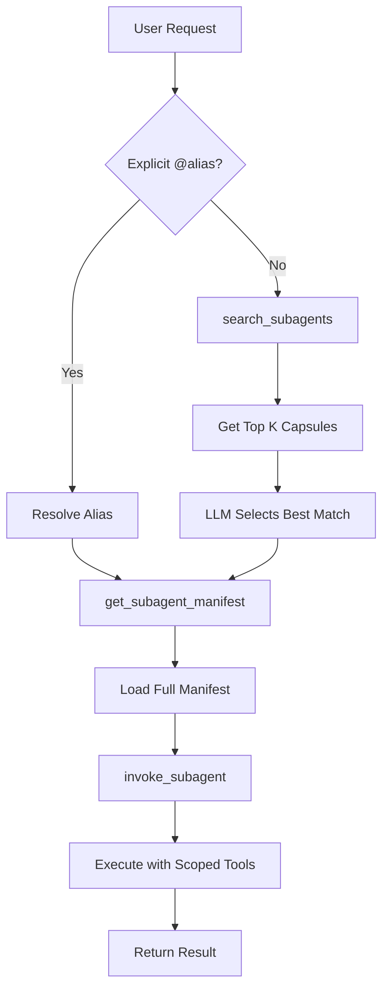

# Migration Guide: V1 → V2 Architecture

This guide explains the changes from the legacy "one MCP tool per subagent" approach to the new "registry with lazy discovery" architecture.

## What Changed?

### Before (V1)
- **N MCP tools** exposed (one per subagent): `subagent_test-runner`, `subagent_migration-planner`, etc.
- All subagent descriptions loaded into context upfront
- Direct tool invocation: `call subagent_test-runner(...)`
- Limited to ~10 subagents before context bloat

### After (V2)
- **4 MCP tools** exposed: `search_subagents`, `get_subagent_manifest`, `list_subagents`, `invoke_subagent`
- Capsule-based discovery: only small summaries loaded initially
- Two-step invocation: search → get manifest → invoke
- Scales to 50-100+ subagents

## For End Users

### Amp Configuration

**No changes required!** The same configuration works:

```json
{
  "amp.mcpServers": {
    "custom-subagents": {
      "command": "custom-subagents-mcp"
    }
  }
}
```

The `custom-subagents-mcp` command now launches the registry server instead of the legacy server.

### Usage Patterns

#### Pattern 1: Natural Language (No Changes)

```
Before: "Use the test-runner to fix failing tests"
After:  "Use the test-runner to fix failing tests"  (same!)
```

Amp will:
1. Call `search_subagents({query: "test runner"})`
2. Get `test-runner` capsule
3. Call `get_subagent_manifest({id: "test-runner"})`
4. Call `invoke_subagent({id: "test-runner", goal: "..."})`

This happens automatically - users don't see the difference.

#### Pattern 2: Explicit Invocation (Works Better)

```
Before: "Use subagent_security-auditor to scan code"
After:  "@security-auditor scan the code"  (cleaner!)
```

The `@alias` syntax is now preferred for explicit invocation.

#### Pattern 3: Discovery (New Capability)

```
User: "What subagents are available for security tasks?"
Amp: [calls search_subagents({query: "security", k: 10})]
     → Lists: security-auditor, ace-curator, ...
```

Now users can discover relevant subagents naturally.

## For Developers

### Defining New Subagents

#### Before (V1)
```typescript
// src/subagents.ts
export const subagents: SubagentRegistry = {
  'my-agent': {
    system: `You are my agent...`,
    permissions: [...]
  }
}
```

#### After (V2)
**Same!** No changes required. The manifest loader converts on-the-fly:

```typescript
// src/subagents.ts (unchanged)
export const subagents: SubagentRegistry = {
  'my-agent': {
    system: `You are my agent...`,
    permissions: [...]
  }
}
```

The system automatically infers:
- Tags (from system prompt keywords)
- Latency class (inner vs outer loop)
- Capabilities (from permissions)
- CLI allowlist (from Bash permissions)

### Advanced: Direct Manifest Format

For maximum control, define manifests directly:

```typescript
// manifests/my-agent.json (future enhancement)
{
  "id": "my-agent",
  "aliases": ["my-agent", "myagent"],
  "summary": "Brief 1-line description",
  "description": "Detailed description...",
  "tags": ["testing", "debugging"],
  "latencyClass": "inner",
  "capabilities": ["code-search", "run-tests"],
  "systemPrompt": "You are my agent...",
  "toolRequirements": {
    "cliAllowlist": [
      { "name": "gh", "installHint": "brew install gh" }
    ]
  },
  "permissions": [...]
}
```

## For Amp Developers

### MCP Tool Interface Changes

#### Legacy Tools (Deprecated but Still Work)

```typescript
// tools/list returns (V1):
[
  {
    name: "subagent_test-runner",
    description: "Full description...",
    inputSchema: { goal, context?, cwd?, timeout? }
  },
  {
    name: "subagent_migration-planner",
    description: "Full description...",
    inputSchema: { goal, context?, cwd?, timeout? }
  },
  // ... N tools
]
```

#### New Registry Tools (V2)

```typescript
// tools/list returns (V2):
[
  {
    name: "search_subagents",
    description: "Search for relevant subagents...",
    inputSchema: { query, k?, tags?, latencyClass? }
  },
  {
    name: "get_subagent_manifest",
    description: "Get full manifest...",
    inputSchema: { id }
  },
  {
    name: "list_subagents",
    description: "List all subagents...",
    inputSchema: { tags?, pageSize?, offset? }
  },
  {
    name: "invoke_subagent",
    description: "Invoke a subagent...",
    inputSchema: { id, goal, context?, cwd?, timeoutMs? }
  }
]
```

### Invocation Flow



## Breaking Changes

### None for End Users

The V2 architecture maintains full backward compatibility for Amp users.

### For Custom Integrations

If you directly called the old MCP tools programmatically:

**Before:**
```typescript
await mcp.callTool("subagent_test-runner", {
  goal: "Run tests",
  context: "...",
})
```

**After:**
```typescript
// Option 1: Search first
const searchResult = await mcp.callTool("search_subagents", {
  query: "run tests"
})
const subagentId = searchResult.capsules[0].id

// Option 2: Use known ID
const subagentId = "test-runner"

// Get manifest (optional, for inspection)
const manifest = await mcp.callTool("get_subagent_manifest", {
  id: subagentId
})

// Invoke
const result = await mcp.callTool("invoke_subagent", {
  id: subagentId,
  goal: "Run tests",
  context: "..."
})
```

## Rollback Instructions

If you need to revert to V1:

### 1. Update Package Scripts
```json
{
  "scripts": {
    "mcp": "tsx src/mcp-server.ts",  // Use legacy server
  }
}
```

### 2. Update bin/custom-subagents-mcp.js
```javascript
const serverPath = join(__dirname, '..', 'src', 'mcp-server.ts')
```

### 3. Restart Amp

The legacy MCP server still exists and works identically to before.

## Performance Comparison

| Metric | V1 | V2 |
|--------|----|----|
| **Tools in context** | N (10-50) | 4 |
| **Initial context size** | Large (all descriptions) | Small (4 tool descriptions) |
| **Discovery latency** | N/A | ~50-150ms |
| **Manifest load latency** | N/A | ~10-50ms |
| **Total overhead** | 0ms | ~60-200ms |
| **Scalability** | ~10 subagents | 50-100+ subagents |

The V2 overhead (60-200ms) is negligible compared to subagent execution time (typically seconds to minutes).

## FAQ

### Q: Will my existing subagents still work?
**A:** Yes, with zero changes required.

### Q: Do I need to update my Amp config?
**A:** No, the same config works.

### Q: Can I use both V1 and V2 simultaneously?
**A:** Not recommended, but you can run `npm run mcp:legacy` for the old server.

### Q: How do I test the new registry?
**A:** 
```bash
# Test search
echo '{"jsonrpc":"2.0","id":1,"method":"tools/call","params":{"name":"search_subagents","arguments":{"query":"security"}}}' | npm run mcp

# Test invoke
echo '{"jsonrpc":"2.0","id":2,"method":"tools/call","params":{"name":"invoke_subagent","arguments":{"id":"test-runner","goal":"List all test files"}}}' | npm run mcp
```

### Q: What if search doesn't find my subagent?
**A:** Improve tags and summary in the subagent definition. The search uses keyword matching on:
- Tags
- Summary
- Capabilities
- ID and aliases

### Q: Can I bypass search and invoke directly?
**A:** Yes! Use `invoke_subagent` with a known ID:
```typescript
invoke_subagent({
  id: "test-runner",
  goal: "..."
})
```

### Q: How do I see all available subagents?
**A:**
```bash
echo '{"jsonrpc":"2.0","id":1,"method":"tools/call","params":{"name":"list_subagents","arguments":{}}}' | npm run mcp
```

## Next Steps

1. Test the registry MCP server: `npm run mcp`
2. Try searching: use the examples above
3. Update custom tooling if you have direct MCP integrations
4. Report any issues or unexpected behavior
5. Enjoy scalable subagent discovery!

## Support

For questions or issues:
1. Check [ARCHITECTURE_V2.md](ARCHITECTURE_V2.md) for technical details
2. Review [README.md](README.md) for usage examples
3. File an issue on GitHub
